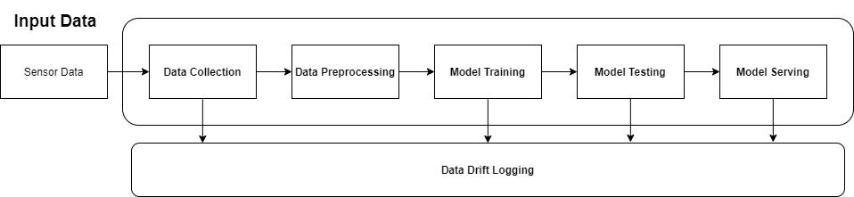
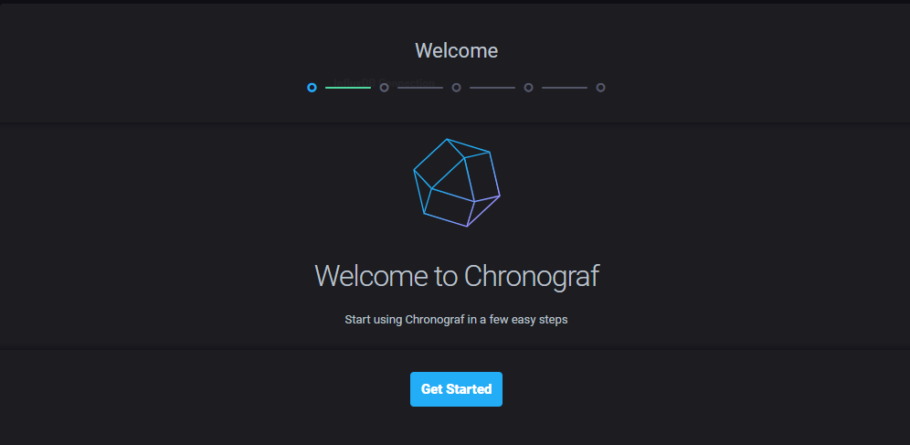
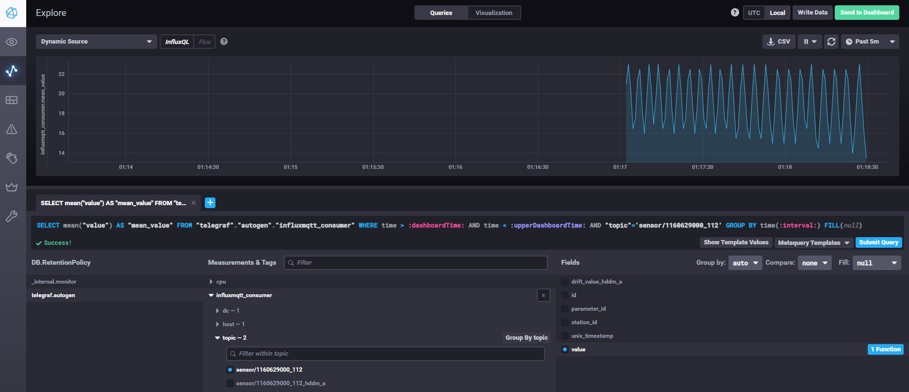
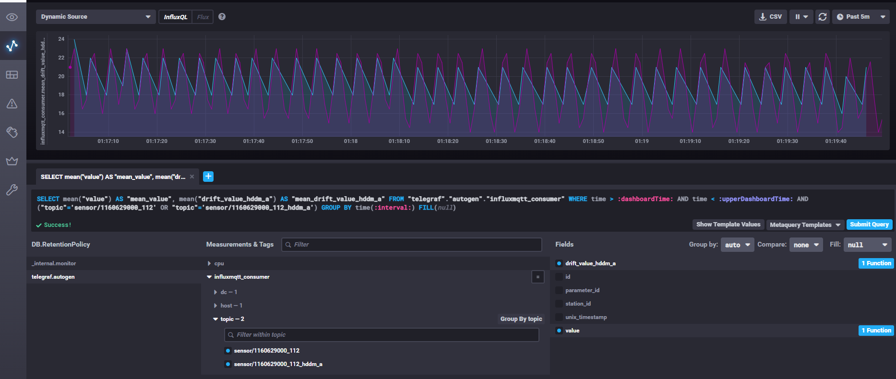
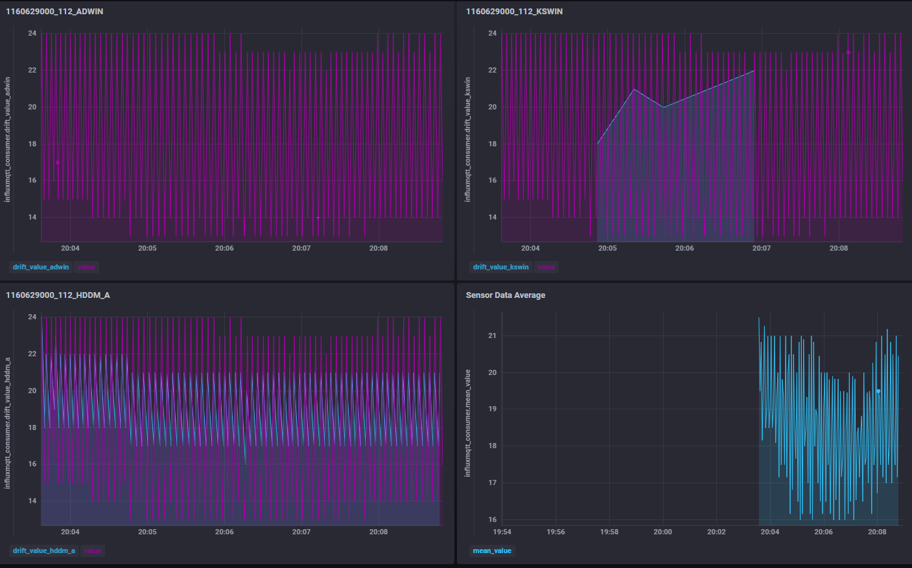
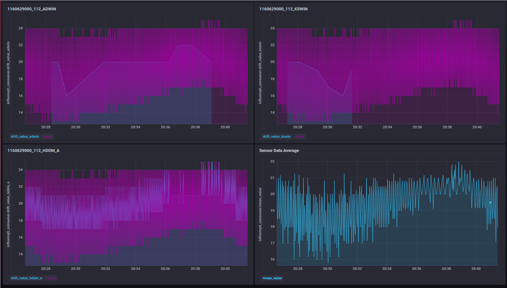
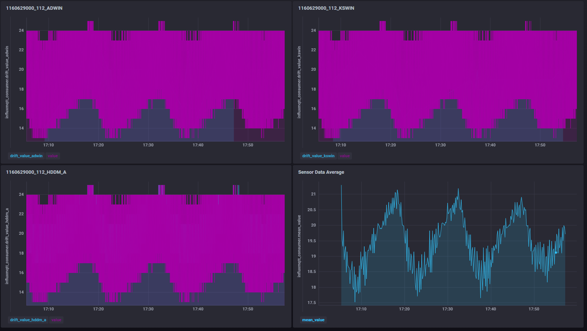
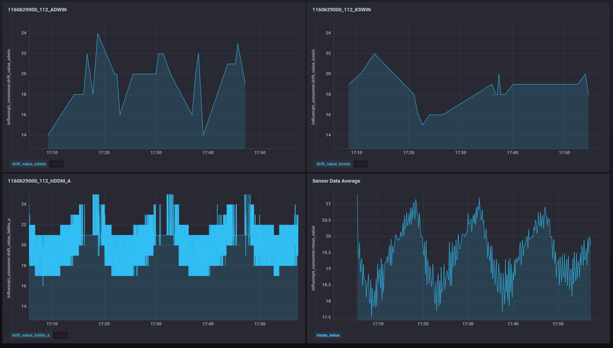
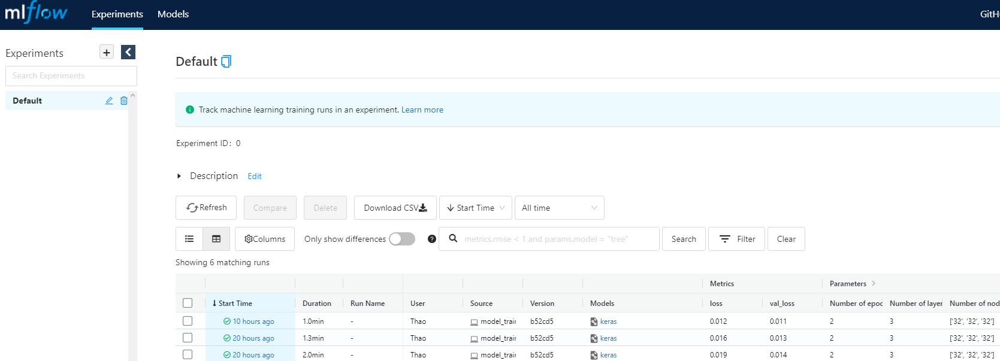
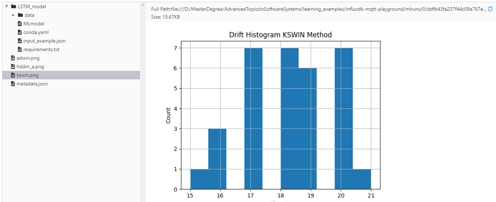

# Monitoring Data Drift for End-to-end Machine Learning Models

## Project Description
This is a project from course Advanced Topics in Software Systems Project (CS-E4660) at Aalto University. The project focuses on collecting data drifts from different phases of machine learning (ML) processes and connect them together for explaining the system behaviors (why the accuracy of the model drop significantly?), or supporting developers to make decision on updating the pipelines (new data representations involve / new data drift pattern) or train the ML models again due to out-of-date training datasets.

## Motivation and Goal
There are many tools for detecting data drift online such as alibi-detect, EvidentlyAI, skmultiflow, Amazon SageMaker Monitor, Data Drift AzureML, Google Vertex AI, but their examples focus on the drift datasets before training the ML models and examples do not cover or capture drifts from different phases of ML phases.

The goal of this project is to capture drift events from sensor data and send them to the training phase where it will hold information of drift-related events and perform model training to observe the model performance based on the loss of test sets. The open-source MLFlow experiment management is used to capture these detected drift from the data collection, store histogram images from different drift detection methods, and keep track them within folder experiment.

In this project, I am using three drift detection methods for checking drift during data collection phase to demonstrate the metric collection for different types, so I use the default parameters for these detections and they could be tuned for achieving better performance or desired requirements depending on specific domains. There are other methods given in this [link](https://scikit-multiflow.readthedocs.io/en/stable/api/api.html#module-skmultiflow.drift_detection):

    + Adaptive Windowing (ADWIN): use sliding fixed window approach to detect drift and any change on newly data arrivals
	+ HDDM_A based on Hoeffding's inequality  s average as estimator, recieve input stream as real values and detect drift if the data is stable/warning/drift 
	+ Kolmogorov-Smirnow Windowing (KSWIN): detect drift using KS-test (statistical test) without assumption on underlying data. (can recieve batch data)


A flow diagram of the project could be seen as followed:


## Use Case
Based on the diagram above, the stakeholder A from IoT industry want to capture the data every momment and detect the drift from these data streams real-time. Furthermore, the collected data from sensors will be pre-processed and used to perform model training to predict future values of the sensors in near future and the purpose of predictive maintenance for every sensor located different stations. Based on predictions of ML models, the health of sensor components could be examined and changed when they are malfunctioning. 

Now let's say the situation got worse due to COVID pandemic and some stations closed due to this. After a while, some sensors are not sending the data (sensors get old or produce incorrect measurements) and they open the stations again to extract the data when the situation get better. During this time, the ML models perform badly with low accuracy on the prediction score and the stakeholders want to know the reason behind this behavior. By having the system defined earlier, we can have a central logging system related to the ML models that have accuracy drop and trace back to how many drifts occured in the training dataset and whether these drifts affect significantly to the model performance.

### Datasets
The dataset is used in this project related to a case study of ML development for predictive maintenance in BTS (Base Transceiver Stations). The raw data can be accessed from this [link](https://github.com/rdsea/IoTCloudSamples/tree/master/data/bts) (currently the raw data is not uploaded, please contact Hong-Linh Truong (linh.truong@aalto.fi) for further information.

## Instruction to run the project

Move to the working directory where the ```requirement.txt``` is located and run the command to install necessary packages:
```
pip install -r requirements.txt
```
Since the raw data already contains all information of different sensors from multiple stations, I have break the data down into one specific sensor (parameter_id=1160629000) and location (station_id=112) for the purpose of demonstration. Run the preprocessing task:

```
py preprocessing_data.py
```
After running the command, this will break down the datasets into different folders (corresponding to station_id) and different sub-folders (corresponding to parameter_id/sensor type), and inside will be the sensor data file. Here I use the file generated from the script located at ```raw_data\process_data\1160629000\112\112.csv```

Before running the application, the environment file should be created ```.env```. Here is example of my environment file for RabbitMQ and connectiong InfluxDB:
```
RABBITMQ_ERLANG_COOKIE=SWQOKODSQALRPCLNMEQG
RABBITMQ_DEFAULT_USER=rabbitmq
RABBITMQ_DEFAULT_PASS=rabbitmq
RABBITMQ_DEFAULT_VHOST=/

HOST_URL_VAR=127.0.0.1
PORT_URL_VAR=8086
INFLUXDB_DB=telegraf
INFLUXDB_ADMIN_USER=influxdb
INFLUXDB_ADMIN_PASSWORD=influxdb
MQTT_CONSUMER_PROBE=influxmqtt_consumer
```

Setup the environment using docker-compose
```
docker-compose up
```
Then, the Chronograf monitoring could be accessed via the [link](http://localhost:8889):

You need to update the Connection URL into this ```http://influxdb:8086``` after Get Started to connect to the database.
After this you send the data using RabbitMQ with MQTT protocal to the topic channel:
```
py .\pub_data.py
```
Go to the monitoring dashboard with proper config and reload the page you get the following information from the MQTT channel:


Next, you can select different option for observing the collected drift sent from the sensors/edge devices as followed:


Then the Dashboards from the Chronograf could be used to observe different types of drift detection methods and it could be presented below. The purple line shows the data sensor of one specific type in 1 station and the blue line shows the drifts are detected from these input streams.
+ Drift and sensor data after 5 minutes of running program:

+ Drift and sensor data after 15 minutes of running program:

+ Drift and sensor data after 55 minutes of running program:



After collected these drift events and data sensor, the model training is performed by connecting to the Influx database and extract relevant data based on the required ```start_time``` and ```end_time```, but in this demo, I set the fixed range. Running the following command to start training the model and tracking the experiments:
```
py model_training.py
```
When the model training is done, the logging parameters can be observed using MLFlow. Thus, visualize experiment results with MLFlow:
```
mlflow ui
```
The result is available at `localhost:5000`

This includes different tracked parameters during training the model, accuracy, loss metrics and other relevant parts (number of layers, number of nodes in each layer, and number of epoch). Furthermore, the artifacts such as output images including hitogram of drift events from different methods are attached, and the details of metadata object is stored as json file, which is discussed further in next section.


## Metadata Object

This metadata object keep track of different information regarding data sources (station_id, parameter_id) and detected drifts from the inputs (drift_objects) with multiple methods based on the "start_date" and "end_date" of the dataset.

```json
{
  "station_id": "1160629000",
  "start_date": "2017-04-15 11:00:03",
  "end_date": "2017-04-18 23:59:35",
  "timestamp": "2021-12-08 14:15:58.984355",
  "parameter_id": "112",
  "experiment_id": "ddfb43fa237f44c09a767e6e1bc09766",
  "mean_val": 19.50286517061629,
  "max_val": 1,
  "drift_objects": [
    {
      "drift_method": "adwin",
      "total_drifts": 26,
      "start_date": "2017-04-15 17:38:28",
      "end_date": "2017-04-18 07:39:52",
      "max_value_drift": 24,
      "min_value_drift": 14,
      "drift_values": {
        "20.0": 8,
        "18.0": 5,
        "22.0": 4,
        "14.0": 2,
        "16.0": 2,
        "21.0": 2,
        "24.0": 1,
        "23.0": 1,
        "19.0": 1
      }
    },
    {
      "drift_method": "hddm_a",
      "total_drifts": 1523,
      "start_date": "2017-04-15 11:01:05",
      "end_date": "2017-04-18 23:56:26",
      "max_value_drift": 25,
      "min_value_drift": 16,
      "drift_values": {
        "21.0": 407,
        "22.0": 277,
        "18.0": 274,
        "17.0": 205,
        "24.0": 87,
        "20.0": 87,
        "19.0": 75,
        "23.0": 75,
        "25.0": 35,
        "16.0": 1
      }
    },
    {
      "drift_method": "kswin",
      "total_drifts": 32,
      "start_date": "2017-04-15 12:30:19",
      "end_date": "2017-04-18 20:14:16",
      "max_value_drift": 21,
      "min_value_drift": 15,
      "drift_values": {
        "20.0": 7,
        "17.0": 7,
        "18.0": 7,
        "19.0": 6,
        "16.0": 3,
        "15.0": 1,
        "21.0": 1
      }
    }
  ],
  "dataset_drift_score": 0.826530612244898
}
```
## Lesson Learned
It took a lot of time on reading these following aspects and how to use and combine them properly into integrated system:

* Reading and testing different samples for Model explanation ([SHAP](https://github.com/slundberg/shap) values) to extract feature attribution regarding model predictions as this could be useful when these base values could be potentially changed due to drifts of datasets
* Benchmarking could be done via Model experiments using MLFlow for managing configuring parameters for LSTM models, collecting metrics from drift detection methods (skmultiflow, alibi-detect) and graphs (histogram of collected drift events), and metadata of dataset-related information (station ID, parameter ID, start date, end date, running time and values for normalizing the test data in preprocessing phase).
* Using message broker such as RabbitMQ with MQTT protocol to send sensor data which could be scaled to multiple devices with the increase in topic channels. Furthermore, I learn about the InfluxDB which supports time-based events (easy to implement with NoSQL data model) which could be scaled with hundrends or more devices sending metrics/data values into the database. 
* Using new time-based DBMS for collecting data via pub/sub topics and displaying them with the help of Chronograf for monitoring the drifts and sensor data. 

## Challenges & Possible Improvements

* I faced problems in extracting model explanation with SHAP values from LSTM model for univariate time-series data or shifted values. Other possible tools for extracting explanations could be used: LIME or DeepShap. With this 
* I implemented the data drift detection on data collection phase using skmultiflow but not in the training datasets. This could be done by Kolmogorov-Smirnov (KS) statistical testing and add the p-value into the metadata object for drift observation in datasets (potential library could be used at this stage: alibi-detect, EvidentlyAI to capture drift boolean and p-value).
* I collect drift events from data collection and map them into datasets used for training, however the connection between model performance/accuracy and detected drifts cannot be made explicitly. The developed system only supports in case providing experiment_id of the model that perform badly in predictions. Thus, using this experiment_id, we can trace back to the model and see drift-related information in datasets (is the number large enough that cause model degradation?).
* I have not built the serving model which uses the model file for serving the test data. This could be achieved with the help for ```mlflow serve``` function and the loss could be stored and observed over time to see if the model loss increases, there could be issues related to datasets.